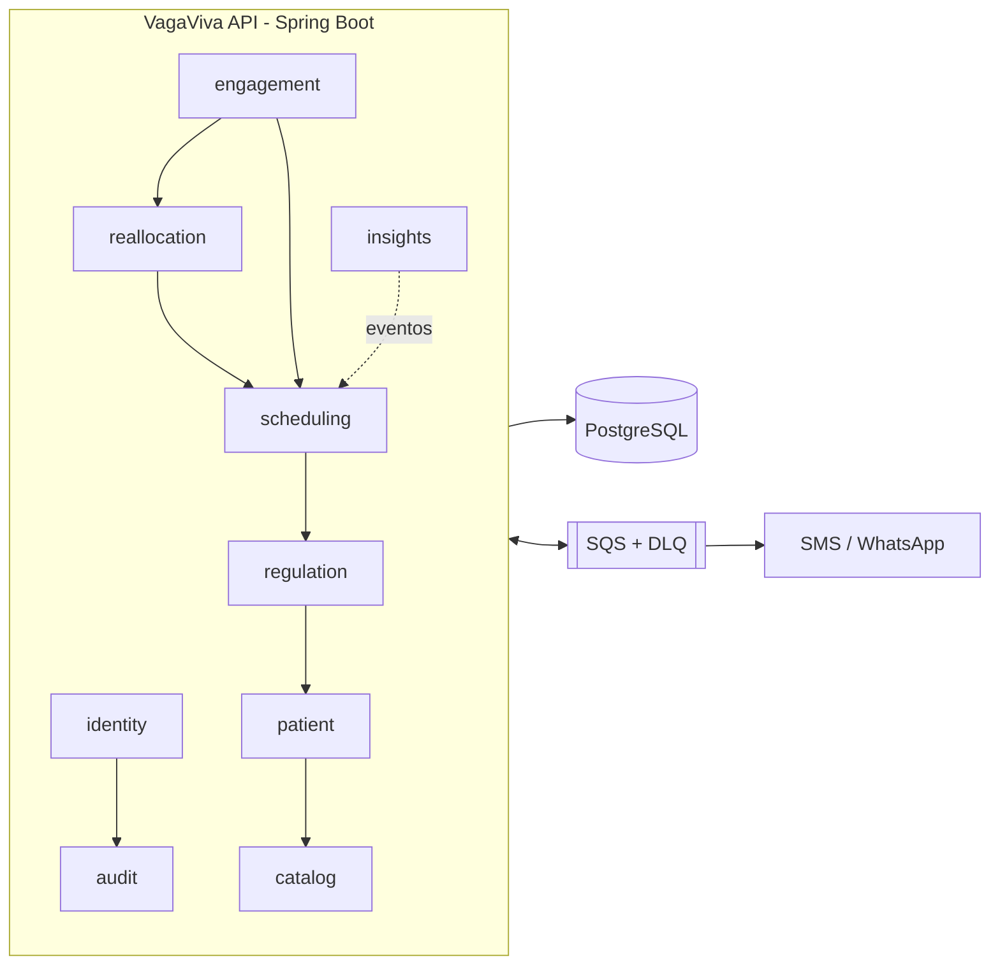

# VagaViva

[](https://github.com/LeviLunique/vagaviva-sus/actions/workflows/ci.yml)
[](https://github.com/LeviLunique/vagaviva-sus/actions/workflows/codeql.yml)

> **Hackathon FIAP — Pós-Tech Arquitetura e Desenvolvimento Java (9ADJT)**
> Autor: **Levi Lunique Izidio da Silva** — RM370139
>
> *"Vaga cancelada não é vaga perdida."*

API REST para **regulação ambulatorial do SUS** com **confirmação ativa** do paciente (WhatsApp/SMS com link seguro) e **reaproveitamento automático de vagas**: toda consulta ou exame cancelado, não confirmado ou desistido volta para a fila priorizada por risco — ou é ofertado como **encaixe em cascata** a quem aceita vaga de última hora.

## Por que

- Dependem exclusivamente do SUS **160 milhões** de brasileiros; a espera média por consulta especializada chegou a **57 dias** (2024).
- De **25% a 40%** das consultas e exames especializados regulados terminam em **falta** — e 31% dos faltosos nem sabiam da data.
- A Política Nacional de Regulação (Portaria GM/MS 9.262/2025) exige priorização por risco, transparência da fila, confirmação/cancelamento por mensagem e o indicador de absenteísmo.

O VagaViva fecha o circuito **agendar → confirmar → reaproveitar** e entrega esses indicadores ao gestor.

## Stack e requisitos

- Java 25, Maven 3.9+ (wrapper incluso)
- Spring Boot 4.1 (Web MVC, Security + OAuth2 Resource Server com JWT RS256, Data JPA, Validation, Actuator) + Spring Modulith 2.1
- ShedLock (jobs agendados executados uma única vez entre instâncias)
- PostgreSQL 17 + Flyway
- Amazon SQS (local: ElasticMQ) para notificações
- Docker / Docker Compose (execução recomendada)
- Testes: JUnit, Mockito, Testcontainers, ArchUnit, JaCoCo (gate de **80%** de linhas e branches)
- Infraestrutura: AWS (`sa-east-1`) com Terraform — CloudFront + WAF, ECS Fargate (ARM64), RDS PostgreSQL, SQS, SNS, Secrets Manager, CloudWatch/X-Ray
- Swagger UI em `/swagger-ui.html`

## Arquitetura

Monólito modular (bounded contexts do Event Storming) com arquitetura hexagonal em cada módulo, eventos de domínio com *outbox* transacional e fila SQS para o envio de mensagens.



- Visão completa (C4, fluxos, AWS): [docs/architecture.md](docs/architecture.md)
- Decisões de arquitetura: [docs/adr/](docs/adr/)
- Dimensionamento para a demanda real do SUS: [docs/capacity-planning.md](docs/capacity-planning.md)
- Segurança e LGPD: [docs/security.md](docs/security.md)

## Como executar

### Via Docker Compose (recomendado)
```bash
cp .env.example .env   # valores locais
docker compose up -d --build --wait
```
Aplicação em `http://localhost:8080` (PostgreSQL em `5432`, SQS local em `9324`).

### Local com Maven
1) Suba só as dependências:
```bash
docker compose up -d db sqs
```
2) Com o JDK 25 ativo:
```bash
export JAVA_HOME="$(/usr/libexec/java_home -v 25)"
./mvnw spring-boot:run -Dspring-boot.run.profiles=local
```

### Variáveis de ambiente principais
| Variável | Padrão local | Descrição |
|---|---|---|
| `DB_HOST`, `DB_PORT`, `DB_NAME`, `DB_USER`, `DB_PASSWORD` | `localhost`, `5432`, `vagaviva`… | PostgreSQL |
| `SERVER_PORT` | `8080` | porta HTTP |
| `PUBLIC_BASE_URL` | `http://localhost:8080` | URL pública anunciada no Swagger (em AWS, a URL da CloudFront) |
| `SPRING_PROFILES_ACTIVE` | `local` | `local`, `aws`, `demo` |
| `JWT_PRIVATE_KEY` | vazio (par efêmero) | chave RS256 dos tokens — Base64 de um PEM PKCS#8; obrigatória no perfil `aws` |
| `BOOTSTRAP_ADMIN_EMAIL`, `BOOTSTRAP_ADMIN_PASSWORD` | `admin@vagaviva.local`, `Admin@Local2026` | administrador criado no primeiro start sem ADMIN |
| `DEMO_USERS_PASSWORD` | `Demo@Local2026` | senha dos usuários de demonstração e dos criados pela coleção Postman |
| `SQS_ENDPOINT` | `http://localhost:9324` | SQS local (ElasticMQ) |
| `AWS_REGION` | `sa-east-1` | região AWS |

Novas variáveis são adicionadas a cada módulo entregue (ver `.env.example`).

## Endpoints

Base `/api/v1`. Implementados até o momento:

| Método | Caminho | Descrição |
|---|---|---|
| GET | `/` | Índice da API (nome, versão e links de descoberta) |
| GET | `/actuator/health` | Health check (liveness/readiness) |
| GET | `/v3/api-docs` · `/swagger-ui.html` | Contrato OpenAPI e Swagger UI (local, hml e demo; desligados em produção) |
| POST | `/api/v1/auth/login` | Login (público) → JWT de 60 min; 5 falhas seguidas bloqueiam por 15 min |
| GET | `/api/v1/auth/me` | Perfil do usuário autenticado |
| POST · GET | `/api/v1/users` | Cadastrar e listar profissionais (filtros `role`, `active`) — ADMIN |
| GET | `/api/v1/users/{id}` | Consultar profissional — ADMIN |
| PATCH | `/api/v1/users/{id}/status` | Ativar/desativar profissional — ADMIN |
| GET | `/api/v1/audit-events` | Trilha de auditoria paginada (filtros `resourceType`, `resourceId`, `actorId`, `from`, `to`) — ADMIN |
| POST · GET | `/api/v1/health-units` | Cadastrar (ADMIN) e listar unidades de saúde (filtros `type`, `municipalityCode`) |
| GET | `/api/v1/health-units/{id}` | Consultar unidade |
| PUT | `/api/v1/health-units/{id}/service-area` | Substituir a área de atendimento (municípios IBGE; vazia = todos) — ADMIN |
| POST · GET | `/api/v1/specialties` | Cadastrar (ADMIN) e listar especialidades/exames (filtro `type`) |
| GET | `/api/v1/specialties/{id}` | Consultar especialidade |
| POST | `/api/v1/patients` | Cadastrar paciente (CNS obrigatório, CPF opcional) — REQUESTER, ADMIN |
| GET | `/api/v1/patients/{id}` | Consultar paciente (CNS/CPF mascarados; leitura auditada) — REQUESTER, REGULATOR, ADMIN |
| POST | `/api/v1/patients/search` | Buscar por CNS **ou** CPF no corpo (nunca na URL) — REQUESTER, REGULATOR, ADMIN |
| PATCH | `/api/v1/patients/{id}/contact` | Atualizar telefone, canal preferido e aceite do WhatsApp — REQUESTER, ADMIN |
| POST · GET | `/api/v1/referrals` | Encaminhar (REQUESTER; gera protocolo `VV-AAAA-NNNNNNN`) e listar (REQUESTER vê só a própria unidade) |
| GET · PUT | `/api/v1/referrals/{id}` | Consultar (leitura auditada) e reenviar encaminhamento devolvido (REQUESTER) |
| POST | `/api/v1/referrals/{id}/regulation` | Aprovar com classe de risco ou devolver com justificativa — REGULATOR |
| POST | `/api/v1/referrals/{id}/cancel` | Cancelamento administrativo — REGULATOR, ADMIN |
| GET | `/api/v1/queues/{specialtyId}` | Fila priorizada (risco → grupo prioritário → data de entrada), paciente mascarado — REGULATOR, MANAGER, ADMIN |
| POST | `/api/v1/queues/snapshot` | Recalcular agora o snapshot da transparência (automático a cada 5 min) — ADMIN |
| POST | `/api/v1/public/queue-position` | **Público**: posição na fila por protocolo + data de nascimento (no corpo) |
| GET | `/api/v1/public/queue-stats` | **Público**: aguardando por classe de risco, espera média e vazão por especialidade |

### Autenticação
```bash
curl -s -X POST http://localhost:8080/api/v1/auth/login \
  -H 'Content-Type: application/json' \
  -d '{"email":"admin@vagaviva.local","password":"Admin@Local2026"}'
```
Nos perfis `local` e `demo` já existem usuários de demonstração de cada papel — `requester@vagaviva.local` (UBS), `regulator@vagaviva.local`, `scheduler@vagaviva.local` (unidade executante) e `manager@vagaviva.local` — com a senha de `DEMO_USERS_PASSWORD`.

Envie o `accessToken` no header `Authorization: Bearer <token>` (no Swagger, botão **Authorize**). Papéis: `ADMIN`, `REQUESTER` e `SCHEDULER` (vinculados a uma unidade de saúde), `REGULATOR` e `MANAGER`. Erros seguem a RFC 9457 (`application/problem+json`) com `code` estável, ex.: `INVALID_CREDENTIALS`, `EMAIL_ALREADY_REGISTERED`, `WEAK_PASSWORD`, `ACCESS_DENIED`.

Módulos do MVP e status de entrega:

| Módulo | Principais recursos | Status |
|---|---|---|
| Identidade e auditoria | `/auth/login`, `/auth/me`, `/users`, `/audit-events` | ✅ |
| Cadastros | `/health-units`, `/specialties`, `/patients` | ✅ |
| Regulação e transparência | `/referrals`, `/queues/{specialtyId}`, `/public/queue-position`, `/public/queue-stats` | ✅ |
| Agenda e alocação | `/slots`, `/allocation-runs`, `/appointments` (check-in, falta) | ⏳ |
| Confirmação ativa | `/patient-actions/{token}` (confirmar, cancelar, desistir), `/p/{token}`, `/notifications` | ⏳ |
| Reaproveitamento de vagas | `/patient-actions/{token}/accept-offer`, `/slot-offers` | ⏳ |
| Indicadores | `/insights/indicators` | ⏳ |

## Modelagem e banco de dados
- Migrations Flyway em `src/main/resources/db/migration` — convenções em [MIGRATIONS](src/main/resources/db/migration/README.md).
- Cada módulo é dono das suas tabelas (sem chaves estrangeiras entre módulos), o que mantém os módulos extraíveis para serviços independentes.
- **Dados de demonstração** (`src/main/resources/db/seed`, perfis `local` e `demo`): 4 UBS, 3 unidades executantes, 8 especialidades (Psiquiatria marcada como sensível) e 30 pacientes fictícios — CNS/CPF gerados pelos algoritmos oficiais, telefones `+55119999900xx`. O seed é idempotente e nunca roda em produção.

## Swagger
Habilitado nos ambientes local, homologação e demo; **desligado em produção** (perfil `aws` puro) para reduzir a superfície de ataque. A documentação interativa fica em `/swagger-ui.html`, com exemplos de requisição e das respostas de sucesso e erro (`application/problem+json`, RFC 9457).

## Postman
Coleção em `postman/vagaviva-api.postman_collection.json` e ambientes `postman/vagaviva-{local,hml,demo}.postman_environment.json`. As pastas seguem a ordem do fluxo de negócio (`00 - Plataforma`, `01 - Autenticação e usuários`, …), cada request tem testes automatizados e a coleção pode ser executada várias vezes na mesma base (dados únicos por execução).

As senhas não ficam no JSON: `adminPassword` e `demoPassword` são injetadas pelo script a partir de `BOOTSTRAP_ADMIN_PASSWORD` e `DEMO_USERS_PASSWORD` (lidas do `.env` no ambiente local). No Postman desktop, preencha essas duas variáveis no ambiente escolhido.

### Testes automatizados via Newman
```bash
docker compose up -d --build --wait
./scripts/run-postman.sh
```
- Usa `npx newman` quando o Node.js está instalado; caso contrário, executa o Newman em container na rede do Compose.
- Outro host: `BASE_URL="https://<distribuicao>.cloudfront.net" POSTMAN_ENV=demo BOOTSTRAP_ADMIN_PASSWORD=... DEMO_USERS_PASSWORD=... ./scripts/run-postman.sh`.
- Relatório JUnit em `target/newman/`.

## Testes e qualidade
```bash
./mvnw verify   # unitários (*Test) + integração com PostgreSQL real (*IT, Testcontainers) + gate de cobertura
```
- Cobertura mesclada (unitários + integração) em `target/site/jacoco/index.html`; o build falha abaixo de **80%** de linhas ou branches.
- `ModularityTest` (Spring Modulith) e `HexagonalArchitectureTest` (ArchUnit) impedem ciclos entre módulos e dependências indevidas entre camadas.
- Desenvolvimento orientado a testes (TDD) e princípios SOLID — veja [CONTRIBUTING.md](CONTRIBUTING.md).

## CI/CD e fluxo de trabalho
- **GitFlow**: `feature/*` → `develop` (homologação) → `release/x.y.z` → `main` (produção, tag `vX.Y.Z`); `hotfix/x.y.z` a partir de `main`.
- **CI** (todo PR): build e testes com cobertura, testes de API (Newman), validação do Terraform, varredura de vulnerabilidades (Trivy), análise estática (CodeQL) e política de PR (fluxo de branches, Conventional Commits e autoria).
- **Deploy** automático via OIDC (sem chaves de acesso): `develop` → hml, tags `v*` → produção, com rollback automático do ECS em caso de falha.

## Infraestrutura AWS
Código em [`infra/`](infra/) (Terraform):
- `infra/bootstrap` — estado remoto (S3), ECR, roles OIDC de deploy e orçamento mensal.
- `infra/stack` — rede em 3 camadas, CloudFront + WAF + VPC origin, ALB interno, ECS Fargate com autoscaling, RDS PostgreSQL, SQS + DLQ, segredos, alarmes e painel. Usado por `infra/envs/hml` e `infra/envs/prod` — o desenho para a demanda real (ver [docs/capacity-planning.md](docs/capacity-planning.md)).
- `infra/envs/demo` — **perfil de apresentação de baixo custo** (não é o design de produção): uma única EC2 roda a API e o PostgreSQL juntos, desliga sozinha quando ociosa e religa sozinha no primeiro acesso seguinte. Ver [ADR-0012](docs/adr/0012-perfil-demo-ec2-unica.md).

> **Estado atual (2026-09-25):** o ambiente `hml` foi desprovisionado (`terraform destroy`) para eliminar custo duplicado — o `demo` é o único ambiente ativo neste momento (URL em `terraform -chdir=infra/envs/demo output api_base_url`). O deploy automático (`develop` → `hml`) está desligado (`AWS_DEPLOY_ENABLED=false`); reative com `./scripts/aws/infra.sh hml apply` seguido de `gh variable set AWS_DEPLOY_ENABLED --repo LeviLunique/vagaviva-sus --body true`.

```bash
./scripts/aws/bootstrap.sh           # uma vez por conta
./scripts/aws/infra.sh hml plan      # plan/apply/destroy/output (hml, prod ou demo)
./scripts/aws/pause.sh hml           # hml/prod: economiza custo fora do horário de uso
./scripts/aws/resume.sh hml

# Perfil demo
./scripts/aws/infra.sh demo apply    # provisiona (ou atualiza) o ambiente de demonstração
./scripts/aws/demo-up.sh             # liga a instância manualmente (ex.: antes de gravar)
./scripts/aws/demo-down.sh           # desliga manualmente (o automático roda a cada 10 min)
./scripts/aws/demo-refresh.sh        # publica a imagem do commit atual e atualiza a instância
./scripts/aws/demo-logs.sh app       # acompanha os logs (app ou db)
```

## Troubleshooting
- **Unsupported class version**: garanta `java --version` = 25 e o mesmo JDK em `./mvnw -v`.
- **Testcontainers com Colima**:
  ```bash
  export DOCKER_HOST=unix://$HOME/.colima/default/docker.sock
  export TESTCONTAINERS_DOCKER_SOCKET_OVERRIDE=/var/run/docker.sock
  ```
- **Bind mount falhando no Colima** (pastas fora do `$HOME`): o Compose já não depende de bind mounts; para o Newman use `npx` (padrão do script).
- **Porta 5432 ocupada**: defina `DB_PORT` no `.env`.
