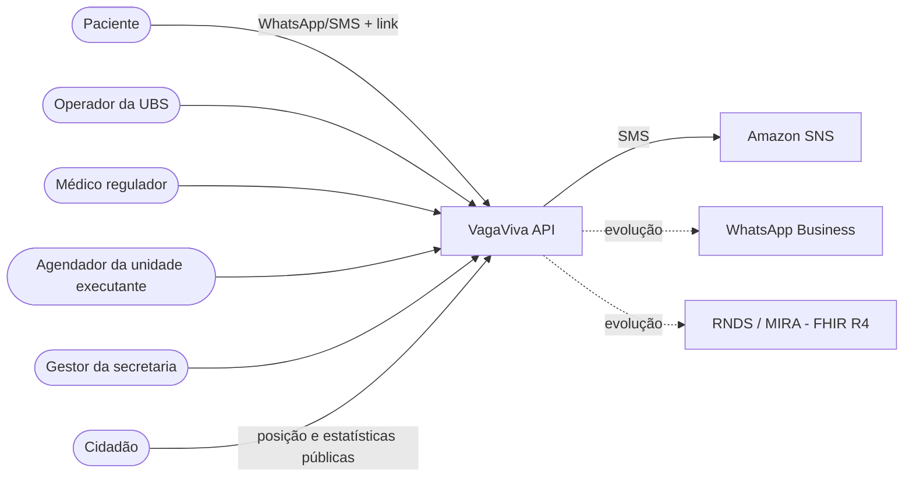
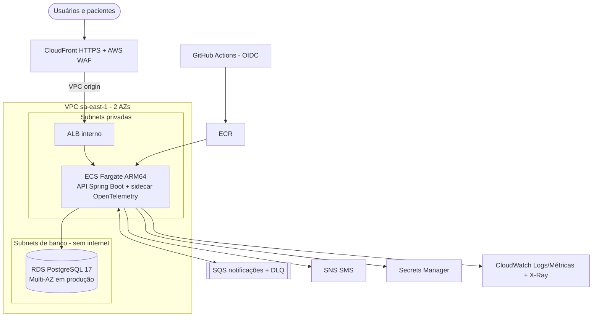
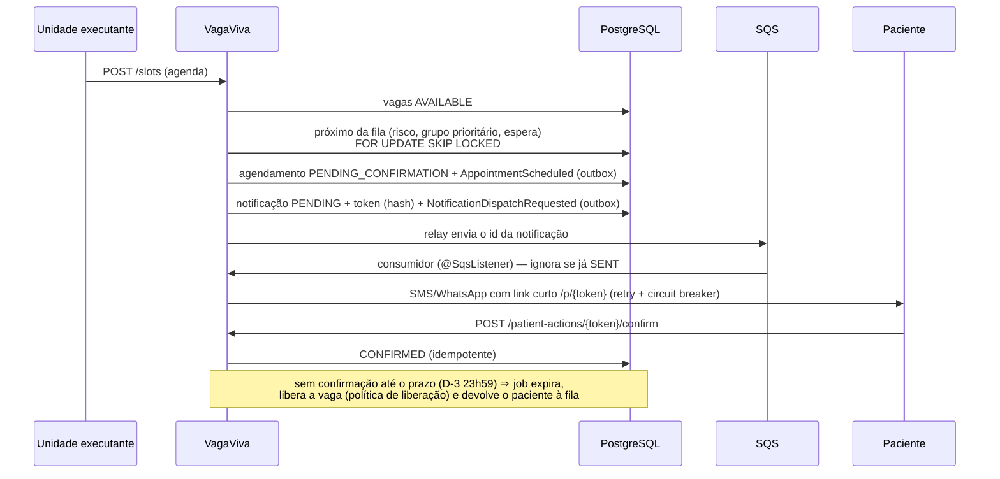
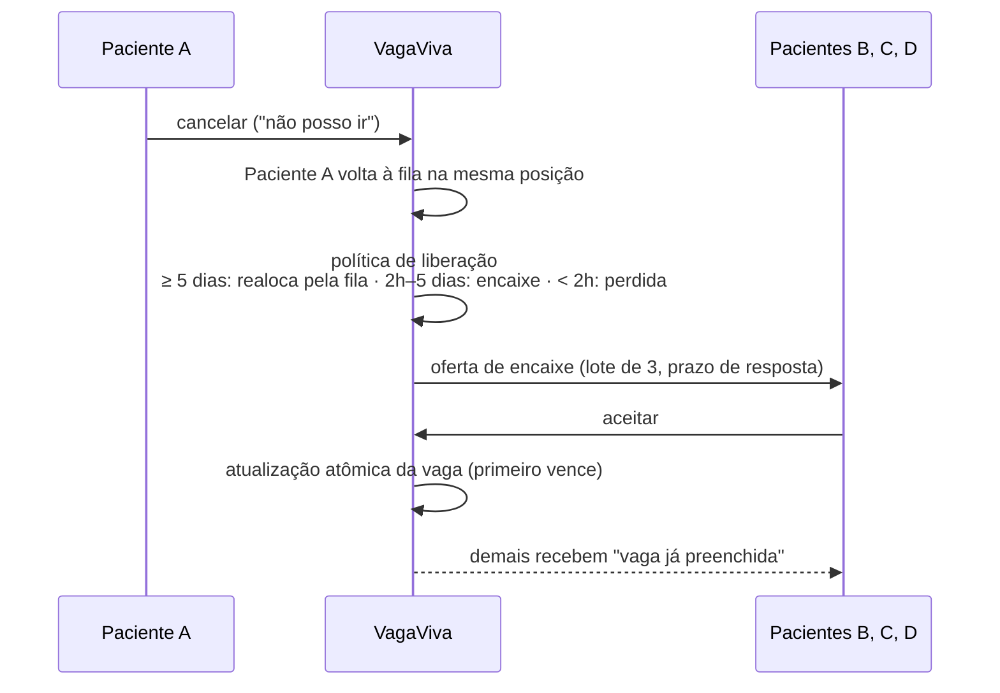

# Arquitetura do VagaViva

## 1. Contexto (C4 — nível 1)



O VagaViva é *API-first*: complementa os sistemas de regulação já usados por estados e municípios, sem exigir troca de sistema.

## 2. Implantação na AWS (C4 — nível 2)



| Camada | Serviço | Por quê |
|---|---|---|
| Borda | CloudFront + WAF | HTTPS sem domínio próprio, HTTP/3, cabeçalhos de segurança, regras gerenciadas (SQLi, XSS, IPs maliciosos) e *rate limit* nas rotas públicas |
| Entrada | ALB **interno** via VPC origin | nenhum endpoint da aplicação exposto diretamente à internet |
| Computação | ECS Fargate ARM64 (Graviton) | contêiner gerenciado, sem servidores para manter, autoscaling por CPU e por requisições, rollback automático de deploy |
| Dados | RDS PostgreSQL 17 | transações ACID para alocação de vagas, consultas de fila e indicadores, backup/PITR, Multi-AZ |
| Mensageria | SQS + DLQ | absorve picos de envio, isola o provedor de SMS/WhatsApp, retentativas e fila de falhas |
| Segredos | Secrets Manager | chave JWT, credenciais do banco e senhas iniciais fora do código |
| Observabilidade | CloudWatch + X-Ray (via ADOT) | logs estruturados, métricas técnicas e de negócio, traces, alarmes e painel |

Ambientes: **hml** (custo mínimo: Fargate Spot, RDS single-AZ, tasks sem regra de entrada além do ALB) e **prod** (Multi-AZ, NAT por AZ, tasks e banco isolados em subnets privadas).

## 3. Módulos (bounded contexts)

| Módulo | Responsabilidade |
|---|---|
| `shared` | Kernel compartilhado: segurança, erros (RFC 9457), ids, relógio, OpenAPI |
| `audit` | Trilha de auditoria de acesso a dados pessoais (LGPD) |
| `identity` | Profissionais, papéis e autenticação (JWT RS256) |
| `catalog` | Unidades de saúde (CNES), área de atendimento e especialidades |
| `patient` | Pacientes (CNS/CPF), contato, preferências e grupos prioritários |
| `regulation` | Encaminhamentos, regulação por risco, fila priorizada e transparência pública |
| `scheduling` | Vagas, motor de alocação, agendamentos, prazos de confirmação, comparecimento e política de liberação |
| `reallocation` | Ofertas de encaixe em cascata para vagas liberadas de última hora |
| `engagement` | Notificações, canais (SMS/WhatsApp/sandbox), links e ações do paciente |
| `insights` | Projeções e indicadores do gestor (absenteísmo, reaproveitamento, espera) |

Cada módulo segue a arquitetura hexagonal:

```
<modulo>/
├── <Modulo>Api.java        ← fronteira pública do módulo
├── events/                 ← eventos de domínio publicados
├── domain/                 ← agregados, value objects, políticas (Java puro)
├── application/            ← casos de uso (port/in), portas de saída (port/out), serviços
└── adapter/                ← in: web, jobs, listeners · out: persistência, integrações
```

As regras são verificadas por testes: `ModularityTest` (ciclos e acesso a internals entre módulos) e `HexagonalArchitectureTest` (dependências entre camadas).

## 4. Fluxos principais

### 4.1 Alocação e confirmação ativa



### 4.2 Vaga liberada → encaixe em cascata



## 5. Estratégia de dados e consistência
- Cada módulo é dono das suas tabelas; relações entre módulos por identificador, validadas pela API do módulo.
- Eventos de domínio são gravados na mesma transação da mudança (registro de publicação do Spring Modulith — *outbox*, tabela `event_publication`) e reentregues em caso de falha. Listeners `@ApplicationModuleListener` rodam depois do commit, em outra thread e transação; publicações concluídas são apagadas (`completion-mode=DELETE`) e as pendentes são reenviadas quando a aplicação reinicia.
- **Motor de alocação (F4)**: cada vaga é alocada numa transação própria — `SELECT ... FOR UPDATE SKIP LOCKED` na vaga e no próximo elegível da fila. Várias instâncias (ou o job e o evento de publicação ao mesmo tempo) alocam em paralelo sem repetir vaga nem paciente, e a falha de uma vaga não desfaz as outras. O índice único parcial `ux_appointment_live_slot` é a última barreira contra alocação dupla.
- **Notificações (F5)**: o módulo `engagement` reage aos marcos do paciente (`ReferralQueued`, `AppointmentScheduled`, `AppointmentCancelled` pela unidade) criando a notificação e publicando `NotificationDispatchRequested` na mesma transação; um *relay* (`@ApplicationModuleListener`) envia o id à fila SQS — se o SQS falhar, a publicação fica pendente no `event_publication` e é reenviada. O consumidor é idempotente (notificação já `SENT` é ignorada), protege o provedor com Resilience4j (retentativa curta + circuit breaker) e, em falha, registra a tentativa e relança: a fila reentrega até 5 vezes e depois move para a DLQ. Canal efetivo: `SANDBOX` no modo de demonstração; em `LIVE`, WhatsApp (com aceite) ou SMS.
- **Política de liberação (F5, RN-15)**: toda vaga devolvida pelo paciente ou por expiração segue a mesma regra — início ≥ 5 dias ⇒ volta a `AVAILABLE` para a fila; entre 2 h e 5 dias ⇒ `OPEN_FOR_OFFERS` (encaixe, F6); < 2 h ⇒ perdida. "Não posso ir" mantém a entrada original na fila; a 2ª não confirmação devolve o encaminhamento à regulação.
- Consistência forte no núcleo (alocação, aceite de oferta) com bloqueio pessimista (`SKIP LOCKED`) e atualização condicional; consistência eventual para notificações e indicadores.
- Leituras de alto volume (posição pública na fila, indicadores) usam *read models* recalculados/projetados (CQRS leve).

## 6. Variante: perfil demo (apresentação de baixo custo)

Mesma aplicação (a arquitetura de software não muda), infraestrutura diferente — ver [ADR-0012](adr/0012-perfil-demo-ec2-unica.md) e [capacity-planning.md §5](capacity-planning.md).

```mermaid
flowchart LR
  u([Usuário]) --> cf[CloudFront]
  cf -- origem primária: VPC origin --> ec2[EC2 única<br/>API + PostgreSQL via Docker Compose]
  cf -. origem de contingência .-> wake[Lambda "acordar"<br/>protegida por OAC/SigV4]
  wake -- liga --> ec2
  sched[EventBridge Scheduler<br/>a cada 10 min] --> idle[Lambda "ociosidade"]
  idle -- sem requisições ha 30 min --> ec2
```

A CloudFront tenta sempre a EC2 primeiro; só chama a Lambda "acordar" quando a origem primária falha (instância desligada). Nenhum IP público é exposto para além da própria CloudFront: o security group da instância só aceita a porta 80 do security group gerenciado pela VPC origin da CloudFront.
