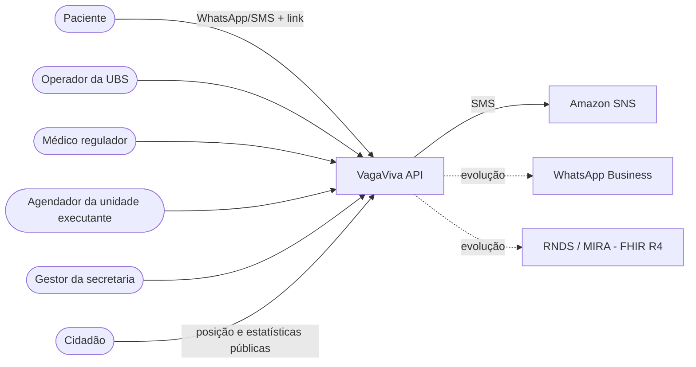
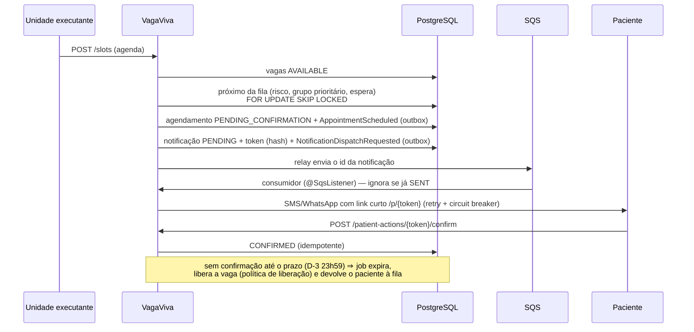

# Arquitetura do VagaViva

## 1. Contexto (C4 — nível 1)


```mermaid
flowchart LR
  pac([Paciente]) -- WhatsApp/SMS + link --> vv[VagaViva API]
  ubs([Operador da UBS]) --> vv
  reg([Médico regulador]) --> vv
  exe([Agendador da unidade executante]) --> vv
  ges([Gestor da secretaria]) --> vv
  cid([Cidadão]) -- posição e estatísticas públicas --> vv
  vv -- SMS --> sns[Amazon SNS]
  vv -. evolução .-> wa[WhatsApp Business]
  vv -. evolução .-> rnds[RNDS / MIRA - FHIR R4]
```

O VagaViva é *API-first*: complementa os sistemas de regulação já usados por estados e municípios, sem exigir troca de sistema.

## 2. Implantação na AWS (C4 — nível 2)

O projeto tem **um único ambiente**, o de demonstração ([ADR-0012](adr/0012-perfil-demo-ec2-unica.md), [ADR-0014](adr/0014-ambiente-unico-demonstracao.md)), com todas as funcionalidades do MVP:

```mermaid
flowchart LR
  u([Usuários e pacientes]) --> cf[CloudFront HTTPS]
  cf -- origem primária: VPC origin --> ec2
  subgraph ec2[EC2 Graviton - Docker Compose]
    api[API Spring Boot] --> pg[(PostgreSQL 17)]
    api -- OTLP --> otel[Coletor ADOT]
  end
  cf -. origem de contingência .-> wake[Lambda "acordar"<br/>protegida por OAC/SigV4]
  wake -- liga --> ec2
  sched[EventBridge Scheduler<br/>a cada 10 min] --> idle[Lambda "ociosidade"] -- 30 min sem acesso: desliga --> ec2
  api <--> sqs[[SQS notificações + DLQ]]
  api --> sm[Secrets Manager]
  otel --> obs[CloudWatch métricas VagaViva + X-Ray]
  gh[GitHub Actions - OIDC] --> ecr[ECR] --> ec2
  gh -- SSM Run Command --> ec2
```

| Camada | Serviço | Por quê |
|---|---|---|
| Borda | CloudFront | HTTPS sem domínio próprio, HTTP/3, cabeçalhos de segurança; a instância não tem porta exposta à internet (VPC origin) |
| Computação e dados | EC2 `t4g.medium` com API, PostgreSQL e coletor OpenTelemetry via Docker Compose | custo mínimo: liga só quando usada (Lambdas de "acordar" e de ociosidade) |
| Mensageria | SQS + DLQ | mesma mensageria do desenho de produção: outbox → fila → canal, retentativas e fila de falhas |
| Segredos | Secrets Manager | chave JWT, senha do banco e senhas iniciais fora do código |
| Observabilidade | CloudWatch + X-Ray (via ADOT) | logs, métricas técnicas e de negócio, painel, alarmes e traces |
| Entrega | GitHub Actions (OIDC) → ECR → SSM Run Command | merge em `main` publica a imagem e aplica na instância (ligando-a se preciso); o compose vem de parâmetros do SSM |

**Desenho para produção real (não provisionado):** CloudFront + WAF → ALB interno (VPC origin) → ECS Fargate ARM64 com autoscaling e rollback automático → RDS PostgreSQL Multi-AZ em subnets sem internet, NAT por AZ. Esse desenho foi implementado em Terraform e validado com teste de carga na F8 — 300 req/s em uma task de 1 vCPU com p95 de ~29 ms no ALB ([capacity-planning.md](capacity-planning.md)) — e saiu do repositório com a ADR-0014, junto com o ambiente de homologação.

## 3. Módulos (bounded contexts)

| Módulo | Responsabilidade |
|---|---|
| `shared` | Kernel compartilhado: segurança, erros (RFC 9457), ids, relógio, OpenAPI |
| `audit` | Trilha de auditoria de acesso a dados pessoais (LGPD) |
| `identity` | Profissionais, papéis e autenticação (JWT RS256) |
| `catalog` | Unidades de saúde (CNES), área de atendimento e especialidades |
| `patient` | Pacientes (CNS/CPF), contato, preferências e grupos prioritários |
| `regulation` | Encaminhamentos, regulação por risco, fila priorizada e transparência pública |
| `scheduling` | Vagas, motor de alocação, agendamentos, prazos de confirmação, comparecimento e política de liberação |
| `reallocation` | Ofertas de encaixe em cascata para vagas liberadas de última hora |
| `engagement` | Notificações, canais (SMS/WhatsApp/sandbox), links e ações do paciente |
| `insights` | Projeções e indicadores do gestor (absenteísmo, reaproveitamento, espera) |

Cada módulo segue a arquitetura hexagonal:

```
<modulo>/
├── <Modulo>Api.java        ← fronteira pública do módulo
├── events/                 ← eventos de domínio publicados
├── domain/                 ← agregados, value objects, políticas (Java puro)
├── application/            ← casos de uso (port/in), portas de saída (port/out), serviços
└── adapter/                ← in: web, jobs, listeners · out: persistência, integrações
```

As regras são verificadas por testes: `ModularityTest` (ciclos e acesso a internals entre módulos) e `HexagonalArchitectureTest` (dependências entre camadas).

## 4. Fluxos principais

### 4.1 Alocação e confirmação ativa


```mermaid
sequenceDiagram
  participant EXE as Unidade executante
  participant API as VagaViva
  participant DB as PostgreSQL
  participant Q as SQS
  participant P as Paciente
  EXE->>API: POST /slots (agenda)
  API->>DB: vagas AVAILABLE
  API->>DB: próximo da fila (risco, grupo prioritário, espera)<br/>FOR UPDATE SKIP LOCKED
  API->>DB: agendamento PENDING_CONFIRMATION + AppointmentScheduled (outbox)
  API->>DB: notificação PENDING + token (hash) + NotificationDispatchRequested (outbox)
  API->>Q: relay envia o id da notificação
  Q->>API: consumidor (@SqsListener) — ignora se já SENT
  API->>P: SMS/WhatsApp com link curto /p/{token} (retry + circuit breaker)
  P->>API: POST /patient-actions/{token}/confirm
  API->>DB: CONFIRMED (idempotente)
  Note over API,DB: sem confirmação até o prazo (D-3 23h59) ⇒ job expira,<br/>libera a vaga (política de liberação) e devolve o paciente à fila
```

### 4.2 Vaga liberada → encaixe em cascata

```mermaid
sequenceDiagram
  participant P1 as Paciente A
  participant API as VagaViva
  participant P2 as Pacientes B, C, D
  P1->>API: cancelar ("não posso ir")
  API->>API: Paciente A volta à fila na mesma posição
  API->>API: política de liberação<br/>≥ 5 dias: realoca pela fila · 2h–5 dias: encaixe · < 2h: perdida
  API->>API: rodada: próximos da fila que aceitam encaixe<br/>(FOR UPDATE SKIP LOCKED, sem quem já recebeu oferta)
  API->>P2: oferta de encaixe (lote de 3, prazo = mín(4 h, início − 2 h))
  P2->>API: POST /patient-actions/{token}/accept-offer
  API->>API: UPDATE slot ... WHERE status = 'OPEN_FOR_OFFERS'<br/>(primeiro vence; agendamento já CONFIRMED)
  API-->>P2: demais recebem 409 "vaga já preenchida"
  Note over API,P2: todos recusam ou o prazo vence ⇒ próxima rodada (até 5);<br/>sem ninguém elegível ou em cima da hora ⇒ vaga perdida
```

## 5. Estratégia de dados e consistência
- Cada módulo é dono das suas tabelas; relações entre módulos por identificador, validadas pela API do módulo.
- Eventos de domínio são gravados na mesma transação da mudança (registro de publicação do Spring Modulith — *outbox*, tabela `event_publication`) e reentregues em caso de falha. Listeners `@ApplicationModuleListener` rodam depois do commit, em outra thread e transação; publicações concluídas são apagadas (`completion-mode=DELETE`) e as pendentes são reenviadas quando a aplicação reinicia.
- **Motor de alocação (F4)**: cada vaga é alocada numa transação própria — `SELECT ... FOR UPDATE SKIP LOCKED` na vaga e no próximo elegível da fila. Várias instâncias (ou o job e o evento de publicação ao mesmo tempo) alocam em paralelo sem repetir vaga nem paciente, e a falha de uma vaga não desfaz as outras. O índice único parcial `ux_appointment_live_slot` é a última barreira contra alocação dupla.
- **Notificações (F5)**: o módulo `engagement` reage aos marcos do paciente (`ReferralQueued`, `AppointmentScheduled`, `AppointmentCancelled` pela unidade) criando a notificação e publicando `NotificationDispatchRequested` na mesma transação; um *relay* (`@ApplicationModuleListener`) envia o id à fila SQS — se o SQS falhar, a publicação fica pendente no `event_publication` e é reenviada. O consumidor é idempotente (notificação já `SENT` é ignorada), protege o provedor com Resilience4j (retentativa curta + circuit breaker) e, em falha, registra a tentativa e relança: a fila reentrega até 5 vezes e depois move para a DLQ. Canal efetivo: `SANDBOX` no modo de demonstração; em `LIVE`, WhatsApp (com aceite) ou SMS.
- **Encaixe em cascata (F6, ADR-0013)**: o módulo `reallocation` reage a `SlotOpenedForOffers` abrindo rodadas de ofertas; cada rodada trava na fila os próximos que aceitam encaixe (mesma ordem oficial, sem quem já recebeu oferta da vaga nem quem tem outra oferta pendente — RN-16). O aceite é serializado pelo `UPDATE` condicional da vaga; o vencedor substitui as demais ofertas na mesma transação. O job de expiração (1 min, ShedLock) encerra ofertas vencidas e abre a rodada seguinte; recusa também avança a cascata. Quem aceita recebe a mensagem de "encaixe confirmado" com o link para liberar a vaga se não puder ir.
- **Política de liberação (F5, RN-15)**: toda vaga devolvida pelo paciente ou por expiração segue a mesma regra — início ≥ 5 dias ⇒ volta a `AVAILABLE` para a fila; entre 2 h e 5 dias ⇒ `OPEN_FOR_OFFERS` (encaixe, F6); < 2 h ⇒ perdida. "Não posso ir" mantém a entrada original na fila; a 2ª não confirmação devolve o encaminhamento à regulação.
- Consistência forte no núcleo (alocação, aceite de oferta) com bloqueio pessimista (`SKIP LOCKED`) e atualização condicional; consistência eventual para notificações e indicadores.
- Leituras de alto volume (posição pública na fila, indicadores) usam *read models* recalculados/projetados (CQRS leve).

## 6. Indicadores e observabilidade (F7)
- **Indicadores (RF-35)**: o módulo `insights` projeta os eventos de agenda e encaixe em duas tabelas de fatos (`appointment_fact`, `slot_release_fact`) — gravação idempotente (`ON CONFLICT DO NOTHING` e atualizações condicionais), então a reentrega de um evento não duplica nada. As consultas agregam os fatos por período (agendamentos pela data do atendimento, liberações pela data da liberação), especialidade e unidade; a fila por risco e o custo das mensagens vêm das APIs públicas da regulação e do engajamento, sem ler tabelas de outros módulos.
- **Métricas (RF-36)**: Micrometer → OTLP → sidecar ADOT → CloudWatch (namespace `VagaViva`, agregados sem dimensão e por dimensão única). Contadores de agendamento, desfecho, liberação, reaproveitamento e perda nascem na projeção (só incrementam quando a linha muda); mensagens no envio; ofertas nas transições; timer da alocação; gauge da fila por especialidade.
- **Traces e logs**: OTLP → ADOT → X-Ray. O contexto de trace é propagado para os listeners assíncronos (`ContextPropagatingTaskDecorator`), então o mesmo `traceId` aparece nos logs da requisição, dos listeners e nas respostas de erro (`problem+json`). Logs sem dados pessoais — verificado por `LogPrivacyIT` nos fluxos principais.
- **Alarmes de negócio** (além dos técnicos): falhas de envio de mensagem (`vagaviva.notifications{status=FAILED}` ≥ 5 em 5 min) e alocação parada (nenhum agendamento por 2 h em horário comercial, via metric math com `HOUR`/`DAY`).

## 7. Religamento automático do demo

A CloudFront tenta sempre a EC2 primeiro; só chama a Lambda "acordar" quando a origem primária falha (instância desligada) e devolve uma página de "iniciando" que se atualiza sozinha. A Lambda de ociosidade desliga a instância após 30 minutos sem requisições na CloudFront, com carência de 30 minutos depois de cada boot (a métrica da CloudFront chega com atraso). Nenhum IP público é exposto além da própria CloudFront: o security group da instância só aceita a porta 80 do security group gerenciado pela VPC origin.
